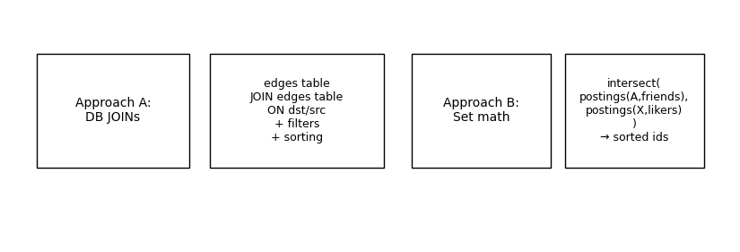
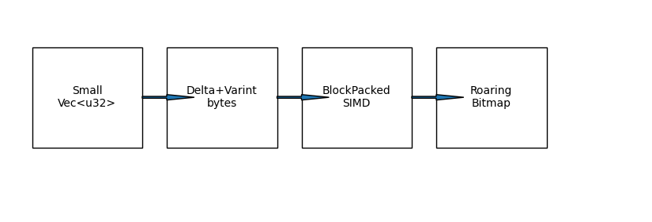
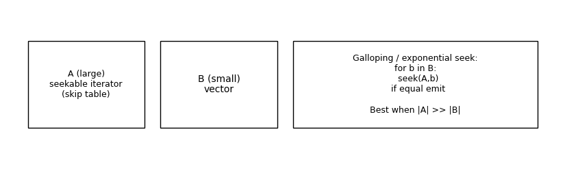
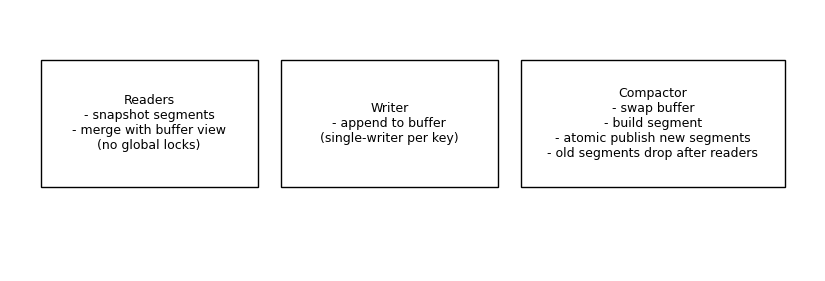
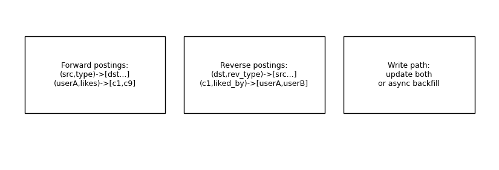

# AOEE – Attribute Object Enterprise Edition
## Implementation-Heavy RFC (Design + Algorithms + Pseudocode)

_Last updated: 2026-02-12 (UTC)_

> TL;DR: AOEE replaces DB join-heavy relationship queries with CPU-efficient **set operations** over in-memory **compressed postings lists**, using an LSM-style write buffer + immutable segments architecture.

---

## 1) “Set math instead of joins” (the confusion clarified)

### The DB-join way
If relationships are stored as rows like:

`edges(src, type, dst)`

and you want:

> “friends of A who liked comment X”

you typically do something equivalent to:

- get `friends(A)` from edges where `(src=A,type=FRIEND)`
- get `likers(X)` from edges where `(dst=X,type=LIKES)` or from a reverse index
- then **join** or **semi-join** those sets in SQL

This frequently forces the DB to:
- read many pages / index entries
- materialize intermediate rows
- do join algorithms (hash join / merge join) over row structures

### The AOEE set-math way
AOEE already stores relationship lists in memory as **sorted integer lists** (postings lists):

- `friends(A)` is a postings list: `[id1,id7,id9,...]`
- `liked_by(X)` is also a postings list: `[id2,id7,id50,...]`

So the query becomes:

`intersect(friends(A), liked_by(X))`

That is literally the same operation as the “AND” operator in a search engine.

**Result:** far less I/O, far less object allocation, and a tight CPU loop over compact arrays.

---

## 2) Core data structure

### Keyed adjacency
`(src_id, edge_type) -> PostingList`

### PostingList layout
- WriteBuffer: mutable append-only entries (fast updates)
- Segments: immutable compressed blocks (fast reads)

This is analogous to:
- LSM: memtable + SSTables
- Lucene: indexing buffer + immutable segments

---

## 3) Representation switching (practical)

Store different encodings depending on size/density:

- **Small Vec<u32>**: simplest, fastest for small lists
- **Delta+Varint**: great compression and simple decoding
- **BlockPacked**: best throughput on mid/large lists; SIMD-friendly
- **RoaringBitmap**: best for huge/dense lists and membership

Policy example:
- len < 128 => Vec<u32>
- 128..4096 => Delta+Varint
- >4096 => BlockPacked
- if density high or degree huge => Roaring

---

## 4) Updates (write-through cache) in detail

### Add edge
1. Persist to DB (source of truth)
2. Append to WriteBuffer
3. Ack

Why append? Because in-place insert into compressed segments is expensive.

### Deletes
1. Persist delete to DB (or tombstone event)
2. Append tombstone into buffer
3. Reads filter tombstoned ids
4. Compaction discards deleted ids

---

## 5) Read path (iterator-first)

Avoid materializing big vectors.
Use iterators:
- SegmentIterator (decode on the fly)
- BufferIterator (sort+dedupe snapshot)
- MergedIterator (merge two sorted streams)
Then apply set ops directly on iterators.

---

## 6) Compaction algorithm (step-by-step)

Compaction trigger: buffer_len > T

Algorithm:
1. Swap buffer with empty (minimize lock time)
2. Sort entries by dst_id
3. Deduplicate
4. Apply tombstones (remove deleted ids)
5. Encode as new segment (delta+varint or blockpack)
6. Atomically publish new segments list
7. Optionally merge segments if too many

---

## 7) Algorithms (implementation detail)

### 7.1 Intersection (merge)
Two-pointer merge over sorted streams.

### 7.2 Galloping intersection
Best when one list is much larger.

Pseudocode:
- for each b in small:
  - seek large to >= b using skip table
  - if equal emit

### 7.3 Union / Difference
Also streaming merge, keeping unique ids.

### 7.4 Friend-of-friend (2-hop)
Compute candidates by unioning neighbor lists of neighbors.
Maintain counts in a hashmap or bounded heap.
Use exclusion filters (direct friends, blocked, self).

Hot-key safeguards:
- cap fanout per neighbor
- sample from huge neighbor lists
- time budget per query

### 7.5 Membership (contains)
- bitmap: O(1)
- vec: binary search
- segments: seek using skip table (coarse) then decode forward

---

## 8) Concurrency: publishing immutable segments

- Writers: single-writer per key
- Readers: read immutable segment snapshot without blocking
- Compactor: builds new segments and swaps pointer atomically

---

## 9) Reverse edges (why you need them)

Many queries are easiest if you store both directions.
Example:
- forward: (user, likes) -> comments
- reverse: (comment, liked_by) -> users

Write options:
- sync dual-write
- async via event stream

---

## 10) Artifacts in this bundle

- `code/aoee_skeleton.rs`
- `code/aoee_skeleton.java`
- `BENCHMARK_PLAN.md`
- `CAPACITY_PLANNING.md`
