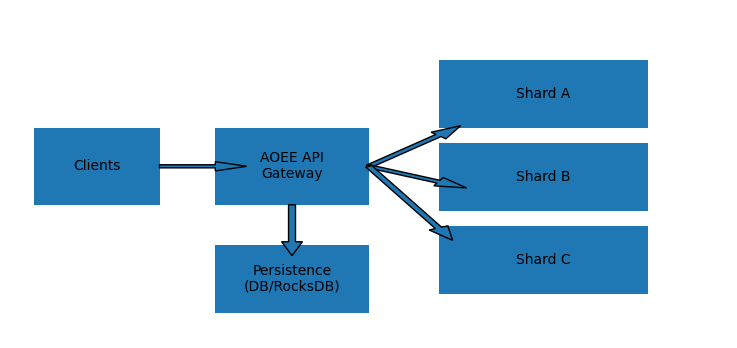
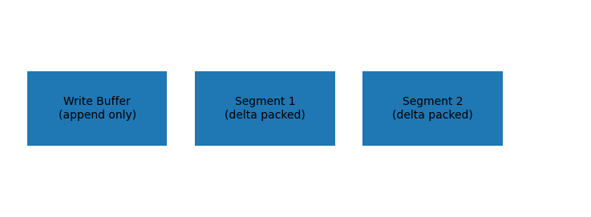
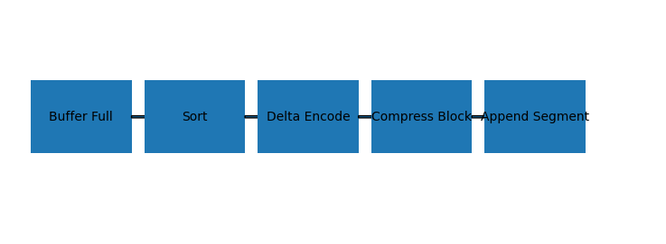
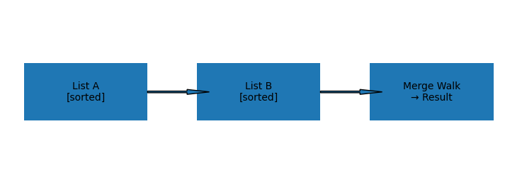

# AOEE – Attribute Object Enterprise Edition
## Detailed Architecture & Design Specification

AOEE is a distributed, write-through, graph-aware cache optimized for relationship-heavy workloads.
It combines ideas from inverted indexes, LSM trees, and distributed caching systems to achieve
sub-millisecond graph queries at scale.

---

# 1. Design Goals

- Extremely fast adjacency lookups
- Efficient set operations (intersection, union, difference)
- Write-through persistence
- Horizontal scalability
- Memory efficiency via compression
- Enterprise reliability

Non-goals:
- Full graph database
- Arbitrary deep traversal queries
- Complex joins in persistence layer

---

# 2. Core Model

## Objects
Users, documents, teams, tickets, etc.

## Edges
(src_id, type, dst_id, metadata, timestamp)

Each edge type is stored as an inverted index (postings list).

---

# 3. Primary Data Structure

Each (src, type) maps to:

WriteBuffer + ImmutableSegments

### WriteBuffer
- small
- append only
- fast writes

### Segments
- compressed
- delta encoded
- immutable
- optimized for reads

---

# 4. Compression Strategy

### Delta Encoding
IDs stored as gaps rather than absolute numbers.

### Varint Encoding
Small gaps use fewer bytes.

### Block Packing
SIMD-friendly fixed blocks.

### Roaring Bitmaps
For dense or huge lists.

---

# 5. Write Path

1. Persist edge to DB
2. Append to buffer
3. Return success
4. Background compaction

Benefits:
- O(1) writes
- predictable latency

---

# 6. Read Path

1. Read segments
2. Read buffer
3. Merge results
4. Return

---

# 7. Compaction

When buffer exceeds threshold:
- sort
- delta encode
- compress
- append as new segment
- clear buffer

---

# 8. Algorithms

## Direct neighbors
O(1) lookup

## Intersection
Merge two sorted lists

## Union / Difference
Linear merge

## Friend-of-Friend
Union of neighbors

## Counts
Length only

## Time filtering
Binary search

## Top-K ranking
Heap or scoring

---

# 9. Sharding

Shard by src_id.

Why:
- adjacency local
- no cross-node joins
- predictable latency

---

# 10. Persistence

Backed by Postgres, RocksDB, or similar.

Tables:
edges(src, type, dst, timestamp, metadata)

Cache miss → lazy load → build segments.

---

# 11. Reliability

- replication
- rebuild from DB
- write-through safety
- tombstones for deletes

---

# 12. Implementation Plan

## Phase 1 – MVP
- in-memory postings
- write-through DB
- basic APIs

## Phase 2 – Compression
- delta + varint
- segments

## Phase 3 – Distribution
- sharding
- replication

## Phase 4 – Enterprise
- ACL edges
- audit logs
- metrics

---

# 13. Tech Stack Suggestions

Rust or Java
gRPC
RocksDB/Postgres
RoaringBitmap library

---

AOEE = TAO-style graph cache + search-engine postings + LSM compaction
